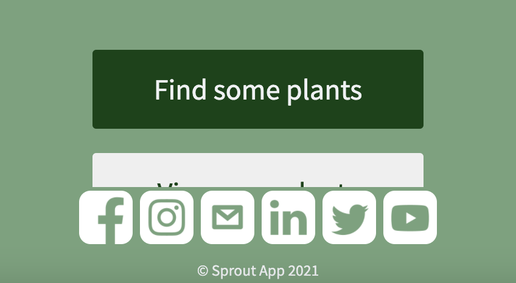

# Plant Pardy
_Be sure to check the PR for code specific feedback_

## General Notes
* This looks great -- super clean, efficient code
* If you click "view your plants" before you've picked any plants, it appears the app is broken -- just an edge case to consider
* I would remove the social icons and instead put the links to your github page and all of your personal linkedins
* I don't see an "About Us" page (minus 1 point) -- make sure to add that so all the plant parent recruiters can find you! :) 
* I only see one page that accepts user input (minus 1 point)
* The mobile first design looks great -- be aware of how it looks on desktop though -- I had a (very) minor display issue on the home page

|                                                                                                                                   | Possible Points | Plant App |
| --------------------------------------------------------------------------------------------------------------------------------- | --------------- | --------- |
| Good and proper use of HTML                                                                                                       | 15              | 15        |
| Good and proper use of CSS                                                                                                        | 15              | 15        |
| Good and proper use of JavaScript                                                                                                 |                 |           |
| Clear, readable, and efficient code                                                                                               | 5               | 5         |
| Uses domain models to encapsulate data and behavior, such as objects and constructors                                             | 5               | 5         |
| Responds to user events to receive/process user input and display new content to the user                                         | 5               | 5         |
| Contains no unnecessary or commented-out code                                                                                     | 5               | 5         |
| Generally useful and functional                                                                                                   |                 |           |
| Works as expected with no bugs                                                                                                    | 5               | 4         |
| Has at least three distinct pages with clear navigation, one of which must be an "About Us" page                                  | 5               | 4         |
| Has at least two pages that accept and process user input (usually, this is a <form> element using the new FormData() constructor | 10              | 8         |
| State is persisted between page reloads, and common state is used between at least two pages.                                     | 10              | 10        |
| TDD: At least three tested JavaScript functions, passing CI in GitHub.                                                            | 15              | 15        |
| Deployed live on the Internet via GitHub Pages                                                                                    | 5               | 5         |
|                                                                                                                                   | 100             | 96        |
